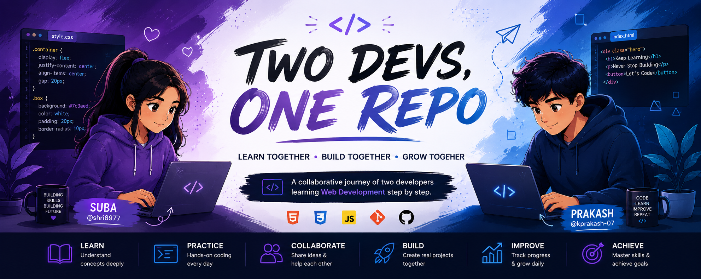

<p align="center">
  
</p>

<h1 align="center">🚀 Two Devs, One Repo</h1>

<p align="center">
  <b>Learn Together • Build Together • Grow Together</b>
</p>
# 🚀 Two Devs, One Repo

> Two developers. One repository. One learning journey.

## 👥 Team

| Name | GitHub |
|------|---------|
| Suba | @shri8977 |
| Prakash | @kprakash-07 |

---

## 📖 About

This repository documents our Web Development learning journey.

For every topic:
- We learn the concept together.
- We practice individually.
- We compare our approaches.
- We improve by reviewing each other's code.

---

## 🎯 Learning Path

- CSS Fundamentals
- Box Model
- Display
- Flexbox
- Grid
- Position
- Responsive Design
- Animations
- Mini Projects

---

## 📂 Repository Structure

```text
Two-Devs-One-Repo/
│
├── README.md
│
├── CSS/
│   ├── 01-Fundamentals/
│   │   ├── README.md
│   │   ├── suba/
│   │   └── prakash/
│   │
│   ├── 02-Box-Model/
│   │   ├── README.md
│   │   ├── suba/
│   │   └── prakash/
│   │
│   ├── 03-Display/
│   ├── 04-Flexbox/
│   ├── 05-Grid/
│   ├── 06-Position/
│   ├── 07-Responsive-Design/
│   ├── 08-Animations/
│   └── 09-Projects/
│
└── Resources/
```

---

## 📁 Folder Explanation

Each topic contains:

### README.md

Contains:
- Theory
- Notes
- Important concepts
- References

### suba/

Contains Suba's:
- Practice files
- Exercises
- Solutions

### prakash/

Contains Prakash's:
- Practice files
- Exercises
- Solutions

---

## 🤝 Our Learning Process

For every topic we follow this workflow:

1. Study the concept.
2. Read the topic README.
3. Practice individually.
4. Compare our implementations.
5. Improve our code.
6. Move to the next topic.

---

## 📌 Example

```text
04-Flexbox/
│
├── README.md
├── suba/
│   ├── index.html
│   └── style.css
│
└── prakash/
    ├── index.html
    └── style.css
```

---

## 🎯 Goal

Our goal is to master Frontend Development by learning consistently, practicing every concept, and building strong coding habits together.

---

> **Learn • Practice • Compare • Improve • Repeat 🚀**
